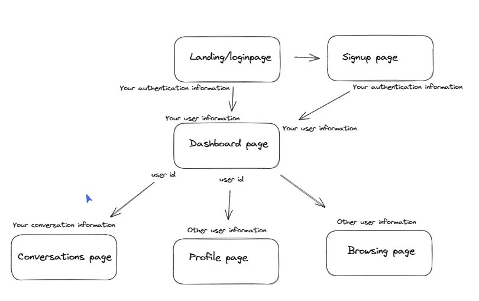

# Date-abase

This is a project with a mission to connect nerds with their dream "programming" partners ;). users will be able to create and account and dating profile by answering a few important questions to determine your best match. You can browse other peoples profile and if you like the look of someone try matching with them and see if they reciprocate. If you end up lucky youll be able to chat.

<a href="https://daterbase.netlify.app/">Deployment Link</a>

# Getting Started/Code Installation

1. Clone the back-end repository

```
git clone https://github.com/maxim-pre/Date-abase-backend.git
```

2. Navigate to this reposity on your machine then run the following commands to install the project dependencies and start the development server.

```
npm install
nodemon server.js
```

3. Clone the front-end repository

```
git clone https://github.com/maxim-pre/date-abase-frontend.git
```

4. Navigate into the front-end repository on your machine and run the following commands to install all the dependencies and start the app.

```
npm install
npm run start
```

# Timeline

- Thursday (Afternoon, design and scoping)
- Friday (All day)
- Saturday (No obligation but working allowed)
- Sunday (No obligation but working allowed)
- Monday (No obligation but working allowed)
- Tuesday (All day)
- Wednesday (All day, MVP due)
- Thursday (All day, refactoring)
- Monday (9am check ins and final changes, 10am project presentation)

# Group planning

Our Mission

- Connect nerds with thier dream "programming" partner ;)

Team Goals $ Values

- MVP first
- Agile working
- Open Communication
- Learning together

Team Communication Preferences

- Breakout rooms in pairs
- Slack messages at any time
- Lunchtime synchronised pulling and merging
- end of day review

Approach

- Backend first, break into 2 pairs and work on different parts of the backend (use Postman to verify)
- Then change the pairings and repeat for the frontend

# Technologies Used

## Stack

- **MongoDB**
- **Express**
- **React**
- **Node.js**
- **Tailwind CSS**

## Npm Packages

- **Mongoose**
- **bcrypt**
- **passport**
- **react-modal**
- **react-icons**

## Other technologies

- **cloudinary**
- **Vscode**
- **Git**
- **Heroku**
- **Netlify**

# Technical Requirements

## Client (Front End)

- Have a working, interactive React app, built using npx create-react-app client

  - have a minimum of 6 components
  - use only react for DOM manipulation

- Consume data from you API , and render that data in your components.

- Utilize React Router
- Authentication!

## Server (Back End)

- Have a working generic router actions for CRUD using Express, Mongoose and MongoDB
- Have at least 2 modals
- Have full CRUD on at least one of your models
- Authentication!

## Styling

- Use flexbox or CSS Grid layout
- implement responsive design on 2 screen sizes (including desktop and mobile)
- You can use a CSS framework if you want to.

## Deployment

- Deploy to MongoDB database to MongoDB Atlas
- Deploy the back-end via Heroku
- Deploy the front-end via netlify

# Planning



View Schema diagram here:

https://excalidraw.com/#room=9c9f4fc8e1279bd72d46,vo3AP7_F2bYc7GiY1E9DCQ

View wire frames here:

https://xd.adobe.com/view/4cc19f9e-36f6-404a-8564-083fd55380cd-1992/?fullscreen&hints=off

## User stories

MVP

- As a user I want to create an account so I can create a personalised experience
- As a user I want to create a bio so I can show potential partners what I’m like
- As a user I want to edit my bio so I can keep it up to date
- As a user I want to answer survey questions so that the website can match me with people that have similar interests.
- As a user I want to specify my gender and which gender(s) I’m interested in so I only see partners who are mutually interested in each other
- As a user I want to browse other users’ profiles so I can learn more about them
- As a user I want to select my favourite users so I can express my interest in them
- As a user I would like the option to select or reject any profile I want

Beyond MVP

- As a user I want to be notified when someone favourites me so I can see if we are interested in each other
- As a user I want to message users I have matched with so we can arrange a date
- As a user I want to be notified when I have favourited someone and they have favourited me, so I can know we are both interested in each other
- As a user I want to upload a photo of myself so other users know what I look like
- As a user I want to get some helpful chat up lines so I can break the ice with my date more easily
- As a user I want to see only the users near me so I can meet them without travelling too far


# Build/Code Process

## Backend

The first step in building the back-end was to initialize the express application, which involved the following steps:

1. Establish a database connected with Mongoose

```Javascript
mongoose.connect(currentDB, { useNewUrlParser: true });
db.once("open", () => console.log("Connected to MongoDB"));
db.on("error", (error) => console.log(`ERROR: ${error.message}`));
db.on("connected", () => console.log(`MongoDB connected at ${currentDB}`));
db.on("disconnected", () => console.log("MongoDB disconnected"));
```

2. instantiate the express application object

```Javascript
const app = express();
```

3. apply middlewares

```javascript
app.use(express.json()); #parse the request body into JSON
app.use(cors({ origin: "*" }));
```

4. tell the application which port to listen for requests

```javascript
app.listen(port, () => console.log(`Date-abase is listening on port ${port}`));
```

Next we split up and started working on different components of the API. I was working with my fellow developer to create the user controller.

This was the first time I had built a project using custom built api routes and creating a hashing system to encrypt users passwords in the database.

I also decided to use the async/await method instead of the promise/catch method as I find this method easier to read and understand as I feel like closer to Javascript functions even if it is asynchronous.

## Front end

On the front end I worked a lot with a fellow developer to create the styling and the logic to get the data from the backend database and display it in the Browse section of the application.

Here is a snippet of code that displays the data from the database and checks to see if the user has already matched with the other users. This data is then passed to the UserCard component and displayed with the appropriate button for the match/not matched feature.

```javascript
const displayUsers = allUsers.map((otherUser) => {
  // Check if current user is in this user's matches array
  if (otherUser.matches.includes(currentUser._id)) {
    otherUser.isMatched = true;
  } else {
    otherUser.isMatched = false;
  }

  return (
    <UserCard
      currentUser={currentUser}
      otherUser={otherUser}
      key={otherUser._id}
      id={otherUser._id}
      firstName={otherUser.firstName}
      lastName={otherUser.lastName}
      bio={otherUser.bio}
      interestedInGender={otherUser.interestedInGender}
      createdAt={otherUser.createdAt}
      isMatched={otherUser.isMatched}
      fetchData={fetchData}
    />
  );
});
```

Here is the user card which I worked on with fellow developer Maxim Prestwich.

```javascript
const interestedInGenders = interestedInGender.map( (gender) => {
        switch (gender) {
            case "M":
                return "men"
                break;
            case "F":
                return "women"
                break;
            case "O":
                return "people with other gender indentities"
                break;
        }
    }).join(" and ");

        return (

        <div className="border w-100 mx-4 my-4 px-4 py-4 bg-[#e8e8e890]">
            <h2 className="text-3xl text-center py-4">{firstName} {lastName}</h2>
            <p className='text-center px-6'>Hi I'm {firstName} and I'm interested in meeting {interestedInGenders}</p>


            <UserPhoto imageUrl={photos[0]} />
            <p className='text-center pb-8'>I joined DaterBase on {joinedAt}</p>
            <div className='flex flex-col items-center'>
                <div>

                {isMatched && <button className="text-4xl bg-red-500 text-white rounded-full px-5 py-4 mr-6 focus:bg-green-500 focus:text-black hover:shadow-2xl hover:bg-yellow-400 hover:text-black" onClick={handleRemoveMatch}>N</button>}
                {!isMatched && <button className="text-4xl bg-green-500 text-white rounded-full px-6 py-4 ml-6 focus:bg-green-500 focus:text-black hover:shadow-2xl hover:bg-yellow-400 hover:text-black" onClick={handleAddMatch}> Y</button>}
                </div>
                </div>
        </div>
```

One of the other major things I learnt and now use regularly is tailwind CSS. I find that using this for layouts and responsive design is great and I can create great UX that look great.

My use of Tailwind for the layout and styling of the site can be seen through all the pages and I utilised my Photoshop skills to soften the background image contrast.

Here is an example of how I utilised Tailwind CSS in this project

```javascript
  <div className="h-screen w-full flex justify-center items-center flex-col bg-[url('../src/static/images/AdobeStock_88856691.jpeg')] bg-top bg-cover">
        <div className="w-full -mt-7">
          <h1 className="text-7xl text-white text text-center text-shadow mb-8">DaterBase</h1>
          </div>
```
